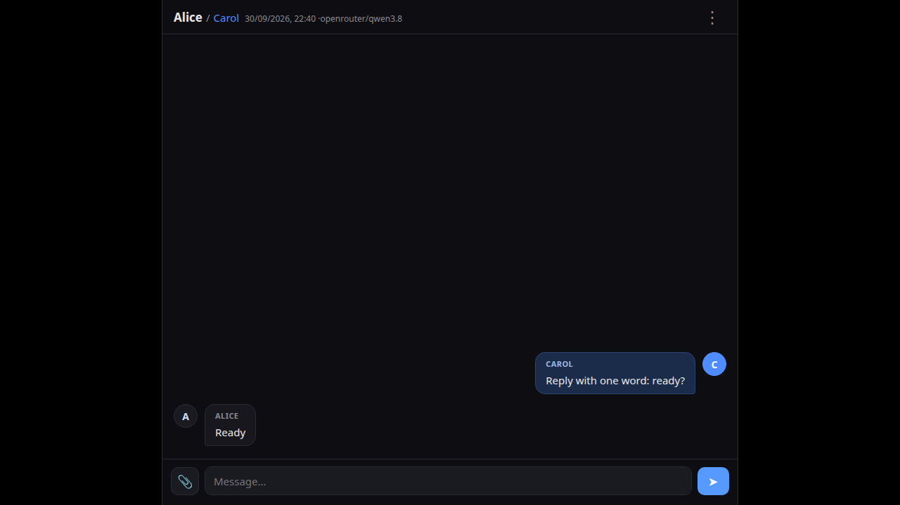

# sillytalk

A chat app for talking to **AI characters**, with **first-class image support**. A user chats with a
configured AI persona; the model can receive images (vision) and generate images — from text, or
from reference images (the character's "starter" photo set, or images already in the chat).

Think of it as a simpler, modern take on SillyTavern / Agnai.

Stack: **Node.js / Express 5 / TypeScript** (backend) + **Angular 22 / SCSS** (frontend).

## Features

- Chat with multiple AI characters (name, description/system prompt, a "starter" photo set folder, avatar).
- User profiles (personas): a name, a description that is passed to the model as information about
  the interlocutor, and an avatar. The persona and the character are picked separately for each
  chat (when creating the chat or in the menu on the name in the header). The user's and the
  character's avatars are shown next to their messages.
- Several OpenAI-compatible models (each with its own `baseUrl` and key), including models that can
  see images.
- Sending text and images; the character's "starter set" images can be used as references.
- Image generation by several methods (tried in order at startup — the first available one is used):
  - **SD API (Stable Diffusion WebUI)** — via the API (`/sdapi/v1/txt2img`, `/sdapi/v1/img2img`);
  - **a local program** — a command launched with `{prompt}`, `{absolutePathsToInputImages}`,
    `{absolutePathToOutputImage}` substituted into the arguments.
- Black theme, a centered chat column, responsive for both desktop and phone.
- The "⋮" button in the header — new chat, model pick (submenu), the chat list, settings, delete.
  Switching the character and the persona — a click on the name in the header.

## Screenshots



<details>
<summary>More screenshots</summary>

- [02a-sent-waiting.png](e2e/screenshots/02a-sent-waiting.png) — a message sent, waiting for the reply
- [05-new-chat.png](e2e/screenshots/05-new-chat.png) — a new empty chat
- [08b-persona-second-message.png](e2e/screenshots/08b-persona-second-message.png) — the next message under the new persona
- [09b-group-replies.png](e2e/screenshots/09b-group-replies.png) — group replies after the mention
- [09c-user-message-edited.png](e2e/screenshots/09c-user-message-edited.png) — an edited user message
- [09d-continued-after-edit.png](e2e/screenshots/09d-continued-after-edit.png) — continuing the conversation after the edit

</details>

## Requirements

- Node.js 20+ (tested on Node 24).
- Optionally: a running OpenAI-compatible backend and/or an SD API (Stable Diffusion WebUI)
  server for image generation.

## Install

```bash
npm run install:all
```

(installs the root, `backend/` and `frontend/` dependencies)

## Run

### Production mode (a single server)

```bash
npm run build
npm run start
```

Open <http://localhost:3210> — the backend serves both the API and the built frontend.

### Development mode (hot reload)

```bash
npm run dev
```

- the backend — <http://localhost:3210>
- the frontend (the dev server, proxies `/api` to 3210) — <http://localhost:4200>

## Configuration

Stored in `~/.config/sillytalk/config.json` (created automatically on the first run, with
examples). It can be edited as a file or through the app's **Settings** menu.

Example:

```jsonc
{
  "listen": "0.0.0.0:3210", // the server listen address (host:port)
  "llmModels": {
    // The key — the model name inside the app (displayed and picked in the menu),
    // referenced by the Chat.modelId field.
    "openrouter/anthropic/claude-3.5-sonnet": {
      "id": "anthropic/claude-3.5-sonnet", // the ID sent to the provider (the OpenRouter model slug)
      "baseUrl": "https://openrouter.ai/api/v1",
      "apiKey": "", // the key directly, or
      "envKey": "OPENROUTER_API_KEY", // the name of an env var holding the key (takes priority)
      "contextSize": 200000,
      "supportsImages": true,
      "reasoning": false, // the reasoning level (false = off), one of reasoningLevels
      "reasoningLevels": ["low", "medium", "high", "xhigh", "max"], // optional (the default set)
    },
  },
  "imageGenerators": [
    // A generation method: either an SD API (API) or a local program.
    // Every enabled and available method works in parallel; the jobs of one
    // method are queued (one at a time). "enabled" defaults to true.
    {
      "url": "http://127.0.0.1:7860",
      "steps": 30,
      "width": 768,
      "height": 768,
      "denoisingStrength": 0.75,
      "negativePrompt": "",
      "enabled": true, // generator toggle (default true)
    },
    {
      "command": "path/to/generator", // e.g. "python" or a .bat/.cmd/.ps1
      "args": [
        "--prompt",
        "{prompt}",
        "--input",
        "{absolutePathsToInputImages}",
        "--output",
        "{absolutePathToOutputImage}",
      ],
      "maxInputImages": 2, // how many references it supports (0 = unlimited)
      "enabled": true,
    },
  ],
}
```

The config is flat: the provider connection is stored straight in each `llmModels` entry
(`baseUrl`, `apiKey`/`envKey`, `contextSize`) — there is no separate "providers" level. The key is
resolved by `resolveApiKey()`: `envKey` (an environment variable) takes priority over
`apiKey` (the literal key).

- `llmModels[].supportsImages: true` — the model can receive images in the chat (then the sent/
  reference images are passed into the prompt as `image_url`).
- `llmModels[].reasoning` — the reasoning level: a string — the level, sent in both common
  OpenAI-compatible spellings at once: top-level `reasoning_effort` (OpenAI, llama.cpp) and
  `reasoning.effort` (OpenRouter); `false` = off, sent as `chat_template_kwargs.enable_thinking=false`
  (the reliable cross-backend off-switch — a provider ignores a field it does not know).
  `llmModels[].reasoningLevels` — the possible levels; when absent the
  default set `low, medium, high, xhigh, max` applies. Edited in the model dialog (the "Reasoning
  levels" input + the "Reasoning" pick).
- Characters are **not stored in the config**: each one is a separate folder
  `~/.config/sillytalk/characters/<id>/`, where the folder name is the character ID and
  `character.json` holds the name and the description (created/edited in **Settings**). The old
  `characters` field in the config is migrated into the folders automatically at startup.
- Users — like the characters: `~/.config/sillytalk/users/<id>/` folders with `user.json` (the name
  and the persona description). There is no "current" user in the config anymore: each chat picks
  its own persona (`Chat.userId`) — in the menu on the name in the header or when creating a chat.
- Avatars: `users/<id>/avatar.jpg` and `characters/<id>/avatar.jpg` — uploaded in **Settings**,
  shown next to the messages.
- Image generation: there can be several methods (`imageGenerators`), each with an `enabled`
  toggle (default `true` — a disabled method is never used). At app startup every method is probed:
  the SD API availability is checked by the `/sdapi/v1/sd-models` response; a local program is
  considered available when a command is set (for an absolute path — if the file exists). **Every
  enabled and available method is used**: images can be generated on several generators at the
  same time, while the jobs of a single generator are queued (one at a time — a program / the
  GPU is not hit by several runs concurrently).
- For the local program: `{prompt}` — the prompt text, `{absolutePathsToInputImages}` — the
  reference absolute paths, comma joined (empty for txt2img), `{absolutePathToOutputImage}` — the
  path where the program must save the PNG.

## Data storage

- Config: `~/.config/sillytalk/config.json`
- Characters: `~/.config/sillytalk/characters/<id>/` — folder name = character ID; `character.json`
  — the name and the description; `photos/` — the "starter" photos (used as references);
  `avatar.jpg` — the avatar
- Users: `~/.config/sillytalk/users/<id>/` — `user.json` (the name and the persona description);
  `avatar.jpg` — the avatar
- Chats: `~/.config/sillytalk/chats/<chatId>/chat.json` (+ `files/` — the uploaded/generated images)

## Project structure

```
backend/
  src/
    index.ts       # the express server: the API + the frontend statics
    routes.ts      # the REST API (config, characters, chats, image, files)
    text_generation/ # the LLM domain: the OpenAI-compatible chat/completions
                     # call (text + images), prompts, [IMG]/[PHOTO] parsing —
                     # the TextGenerationService class + its DI token
    image_generation/ # generation: the driver interface, the SD API / local
                      # program backends, the top-level service class
                      # (background jobs); di.ts — the minimal DI container
    chats/         # the chat storage in the chats/<id>/ folders —
                   # the ChatsService class + its DI token
    characters/    # the character storage in the characters/<id>/ folders —
                   # the CharactersService class + its DI token
    users.ts       # the user storage in the users/<id>/ folders
    config.ts      # the config load/save, the paths
    types.ts       # the types
frontend/
  src/app/
    app.ts         # the root component (the header, the chat, the input, the menus)
    settings.ts    # the settings modal (the config, the users, the characters)
    settings.scss  # the settings dialog styles
    api.ts         # the HTTP client service + the types
    app.scss       # the styles (the dark theme, responsive)
```

## Build / tests

```bash
npm run build           # the backend (tsc) + the frontend (ng build) build
cd backend && npm test  # the backend tests (jest)
cd frontend && npm test # the frontend tests
```

## License

MIT — see [LICENSE](LICENSE).
